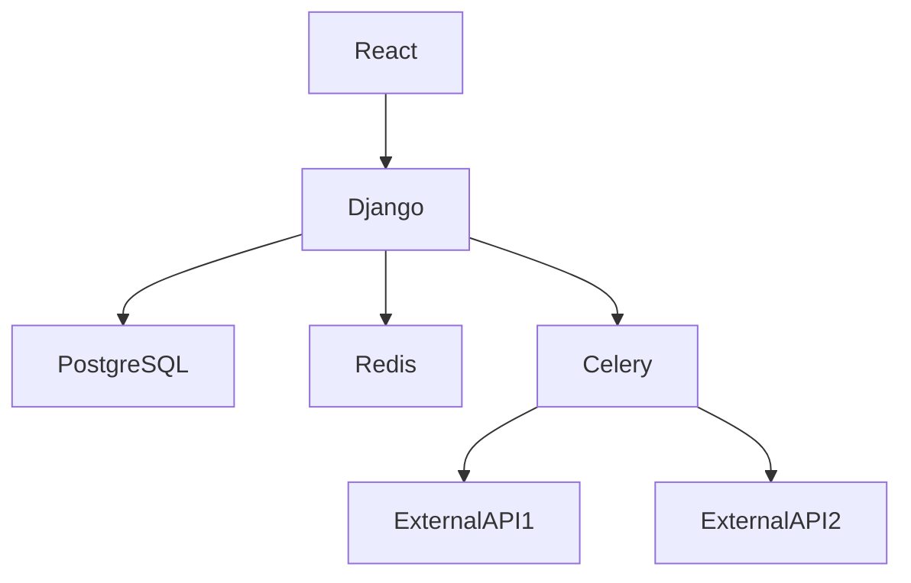

# Project Overview

This project is a comprehensive inventory management system built with Django, React, and other relevant technologies. It allows users to manage products, companies, and user authentication through REST APIs.

## Local Dev Setup with Docker Compose (Step by Step)

1. **Install Docker and Docker Compose**: Ensure you have Docker and Docker Compose installed on your machine.
2. **Clone the Repository**: Clone this repository to your local machine.
   ```sh
   git clone https://github.com/your-repo/inventory-app.git
   cd inventory-app
   ```
3. **Build the Docker Images**: Run the following command to build the necessary Docker images.
   ```sh
   docker-compose up --build
   ```
4. **Migrate Database**: After the containers are running, apply migrations to set up the database schema.
   ```sh
   docker-compose run web python manage.py migrate
   ```
5. **Create Superuser**: Create a superuser to access the Django admin panel.
   ```sh
   docker-compose run web python manage.py createsuperuser
   ```
6. **Run Migrations and Seed Demo Data**: Run migrations and seed demo data using the provided scripts.
   ```sh
   docker-compose run web python manage.py loaddata initial_data.json
   ```
7. **Access the Application**: Open your web browser and navigate to `http://localhost:3000` to access the React frontend.

## Environment Variable Reference Table

| Variable Name          | Description                           | Example Value  |
|------------------------|---------------------------------------|----------------|
| DJANGO_SECRET_KEY        | Secret key for Django                 | mysecretkey    |
| DEBUG                    | Enable or disable debug mode            | true           |
| DATABASE_URL             | Database URL                          | postgresql://user:password@db:5432/mydatabase |
| REDIS_URL                | Redis URL                             | redis://redis:6379/1 |
| CELERY_BROKER_URL        | Celery broker URL                     | amqp://guest:@celery-broker:5672// |
| SHOPIFY_APP_KEY          | Shopify app key                       | yourappkey     |
| SHOPIFY_APP_SECRET       | Shopify app secret                    | yourappsecret  |

## Running Migrations and Seed Demo Data

1. **Apply Migrations**:
   ```sh
   docker-compose run web python manage.py migrate
   ```
2. **Seed Demo Data**:
   ```sh
   docker-compose run web python manage.py loaddata initial_data.json
   ```

## Running Tests

To run the tests, execute the following command:
```sh
docker-compose run web python manage.py test
```

## API Endpoint Summary Grouped by Module

### Authentication Module

1. **Register User**
   - **URL**: `/api/register/`
   - **Method**: `POST`
   - **Request Body**:
     ```json
     {
       "username": "user",
       "email": "user@example.com",
       "password": "secure_password"
     }
     ```

2. **Login User**
   - **URL**: `/api/login/`
   - **Method**: `POST`
   - **Request Body**:
     ```json
     {
       "username": "user",
       "password": "secure_password"
     }
     ```

3. **Logout User**
   - **URL**: `/api/logout/`
   - **Method**: `POST`

### Inventory Module

1. **Create Product**
   - **URL**: `/api/products/`
   - **Method**: `POST`
   - **Request Body**:
     ```json
     {
       "company": 1,
       "sku_code": "SKU12345",
       "name": "Product Name",
       "category": "grains",
       "unit": "kg",
       "reorder_threshold": 10,
       "target_margin_percent": 5.0,
       "is_perishable": false,
       "shelf_life_days": 90
     }
     ```

2. **Read Products**
   - **URL**: `/api/products/`
   - **Method**: `GET`
   - **Query Parameters**:
     - `category`: Filter products by category.
     - `search`: Search products by name or SKU code.

3. **Update Product**
   - **URL**: `/api/products/{id}/`
   - **Method**: `PUT`
   - **Request Body**:
     ```json
     {
       "name": "Updated Product Name",
       "category": "dairy"
     }
     ```

4. **Delete Product**
   - **URL**: `/api/products/{id}/`
   - **Method**: `DELETE`

## Mermaid Architecture Diagram



This diagram shows the flow of data and services within the system, from the frontend (React) to the backend (Django), database (PostgreSQL), caching (Redis), task queue (Celery), and external APIs.